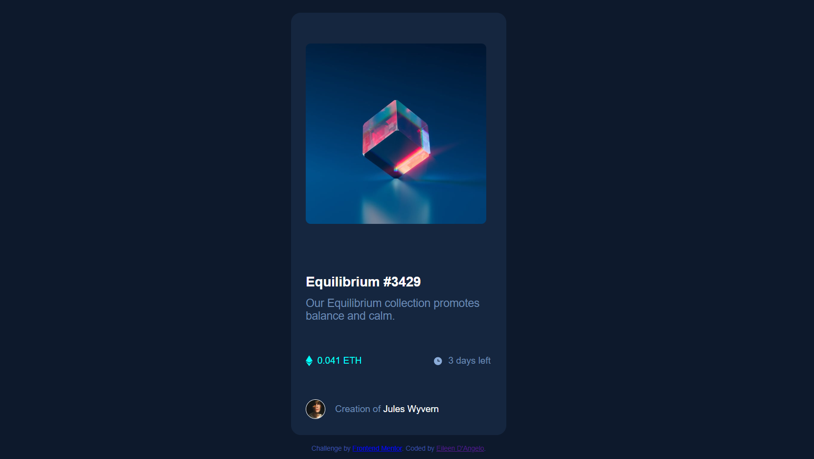

# Frontend Mentor - NFT preview card component solution

This is a solution to the [NFT preview card component challenge on Frontend Mentor](https://www.frontendmentor.io/challenges/nft-preview-card-component-SbdUL_w0U). Frontend Mentor challenges help you improve your coding skills by building realistic projects. 

## Table of contents

  - [The challenge](#the-challenge)
  - [Screenshot](#screenshot)
  - [Links](#links)
- [My process](#my-process)
  - [Built with](#built-with)
- [Author](#author)

### The challenge

Users should be able to:

- View the optimal layout depending on their device's screen size
- See hover states for interactive elements

### Screenshot

### Links

- Solution URL: [(https://github.com/Eileenpk/nft-preview-card-component.git)](https://your-solution-url.com)
- Live Site URL: [(https://eileenpk.github.io/nft-preview-card-component/)](https://your-live-site-url.com)

## My process
- Write Html
- Write Css 

### Built with

- Semantic HTML5 markup
- CSS custom properties
- Flexbox
- Mobile-first workflow

## Author
- Frontend Mentor - [@Eileenpk](https://www.frontendmentor.io/profile/Eileenpk)
- LinkedIn - [@EileenD'Angelo](www.linkedin.com/in/eileen-d-angelo-4178ab22b)

